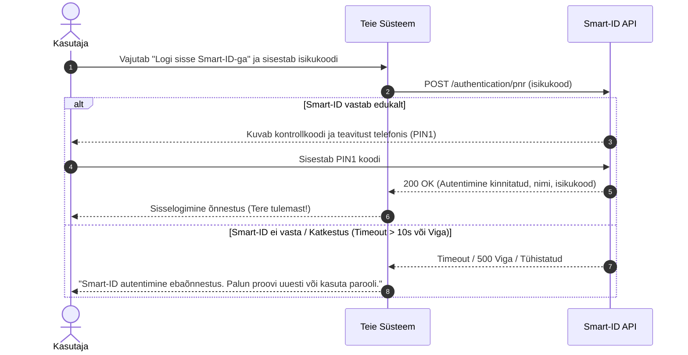

# arendusmeetodid

## Diagrammid

## Projekti tüübid

### (a) Uus funktsioon: Automaatne tühistamine ja teavitus
- **Tüüp:** olemasoleva süsteemi arendus
- **Mis muutub:** Lisandub uus klass `BookingCancellationService`, täiendatakse klasse `Booking` ja `NotificationService` ning lisatakse teavituse saatmise loogika.
- **Mis jääb samaks:** Olemasolev autentimissüsteem, kasutajate profiilid ja andmebaasi põhistruktuur.
- **Peamine risk:** Automaatse kontrolli (cron-job) valesti seadistatud ajavöönd tühistab broneeringud valel ajal või saadab kasutajatele valeteavitusi.
- **Esimene samm:** Kirjutada automaattestid (unit tests) olemasolevale tühistamisloogikale enne uue koodi kirjutamist.

---

### (b) Üleviimine: PHP 5 + MySQL → Node.js + PostgreSQL
- **Tüüp:** üleviimine uuele platvormile
- **Mis muutub:** Kogu backend-kood kirjutatakse ümber Node.js peale, andmebaas viiakse MySQL-ist PostgreSQL-i.
- **Mis jääb samaks:** Kõik kasutajalood, ekraanid ja äriloogika reeglid.
- **Peamine risk:** Ajalooliste andmete (kasutajad, broneeringud, maksed) migreerimisel tekivad andmetüüpide ühilduvusvead või andmekadu.
- **Esimene samm:** Viia läbi proovimigratsioon (dry-run) viimaste andmete koopia peal ja loendada kirjed enne koodi ümberkirjutamist.

---

### (c) Liidestamine: Smart-ID sisselogimine
- **Tüüp:** liidestamine
- **Mis muutub:** Autentimismoodul `AuthController`, sisselogimise ekraan (UI) ja turvamärkide haldus.
- **Mis jääb samaks:** Tavaline parooliga sisselogimine ja kasutajaprofiili andmemudel.
- **Peamine risk:** Smart-ID välise API katkestuste tõttu ei saa kasutajad sisse logida ja süsteem jääb ootama (timeout).
- **Esimene samm:** Tutvuda Smart-ID API dokumentatsiooniga ja seadistada demo-päring (sandbox environment).
- **Saadame:** Kasutaja isikukood.
- **Saame vastu:** Autentimise staatus (OK/CANCELLED/TIMEOUT), kasutaja ees- ja perekonnanimi.
